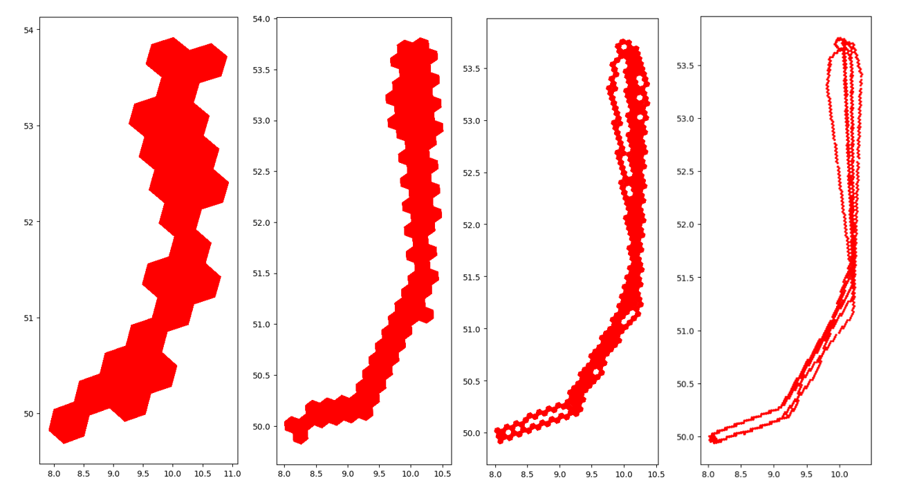
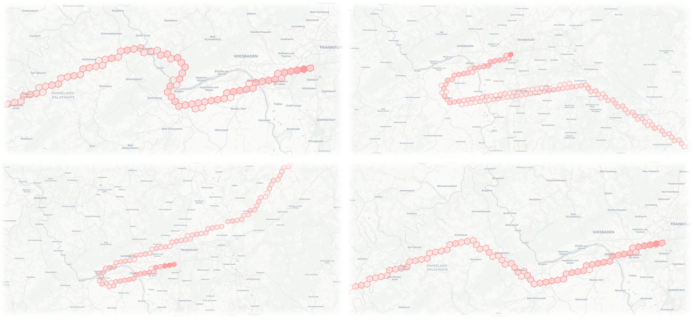

# **H3‑Cell‑Based Arrival‑Time Prediction for Lufthansa Flights**

> LMU‑Munich Data Science Practical in cooperation with Lufthansa Group

<h2 align="center"></h2>

  
  

---

## Overview

This project builds a full pipeline that turns raw ADS‑B surveillance data into minute‑level ETA predictions for Lufthansa flights inbound to Frankfurt (EDDF).
Key points:

* Uses **H3 hexagonal spatial indexing** to capture local traffic density along each trajectory
* Supports whole‑route and last‑100 km prediction modes
* Codebase: data download, feature engineering, model training, evaluation, and inference

## Approach at a glance

* **Features:**
  * Position (distance‑to‑runway, sine/cos‑encoded lat / lon and  bearing)
  * Kinematics (altitude, vertical speed, ground speed)
  * Dynamic H3 traffic density
  * Calendar & cyclic time (weekday, holiday, sine/cos‑encoded time‑of‑day and day‑of‑year)
* **Targets:** seconds‑to‑touchdown (full) or seconds‑to‑touchdown within 100 km
* **Models:** polynomial regression, XGBoost, MLP, LSTM
* **Interpretability:** SHAP plots available in `src/evaluations/`

## License

MIT - see [LICENSE](LICENSE).

## Acknowledgements

* **Dr. Viktor Bengs** (LMU Chair of Artificial Intelligence and Machine Learning) - academic supervision and guidance
* **Dr. Sebastian Weber** - industry mentor (Lufthansa Group)
* **OpenSky Network** for ADS‑B data

